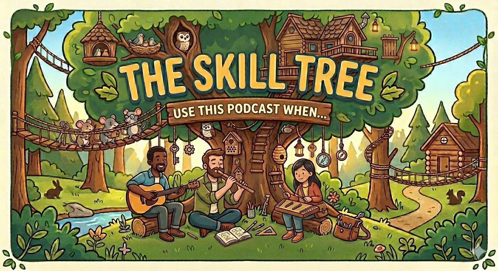

# The Skill Tree Podcast

A weekly show about building effective agentic experiences.

[Podcast Listing](https://podcastindex.org/podcast/7761170) | [RSS feed](https://skilltree.fm/feed.xml)

## Explore The Show

Use progressive disclosure for all podcast lookups. Start from the single most relevant `index.md` for the question, then follow only the links surfaced there into narrower reference pages.

Do not manually discover podcast content with broad file searches, file globs, ripgrep, or web search as a first resort. If the relevant index page is missing, incomplete, or does not link to the needed material, say that the local podcast reference is incomplete before falling back to other discovery methods.

## Decision Tree

Answer these questions in order before opening any file. Stop at the first match and open only that file.

1. **Is this about an episode?** (title, number, opening paragraph, transcript)
   → `references/episodes/index.md`

2. **Is this about a person?** (host, guest, speaker bio, appearances)
   → `references/speakers/index.md`

3. **Is this about a thing mentioned on the show?**
   - **Do you know its kind?** (framework, organization, product, skill, tool)
     → `references/directory/kind/index.md` — pick the matching kind page
   - **Otherwise**
     → `references/directory/index.md`

## Lookup Rules

1. Open only the one file selected by the decision tree above.
2. Follow links from that file into narrower indexes or individual records as needed.
3. Do not read multiple top-level indexes up front.
4. Do not scan past a "Property Indexes" section into "Records" until you have checked whether a property index applies.
5. To see where a record appears (e.g., which episodes mention it), check for a sibling `.index.md` file. For example, `ideation.md` has a companion `ideation.index.md` that lists episode backreferences.
6. If the indexes do not provide a path, report the gap before using broader search.
